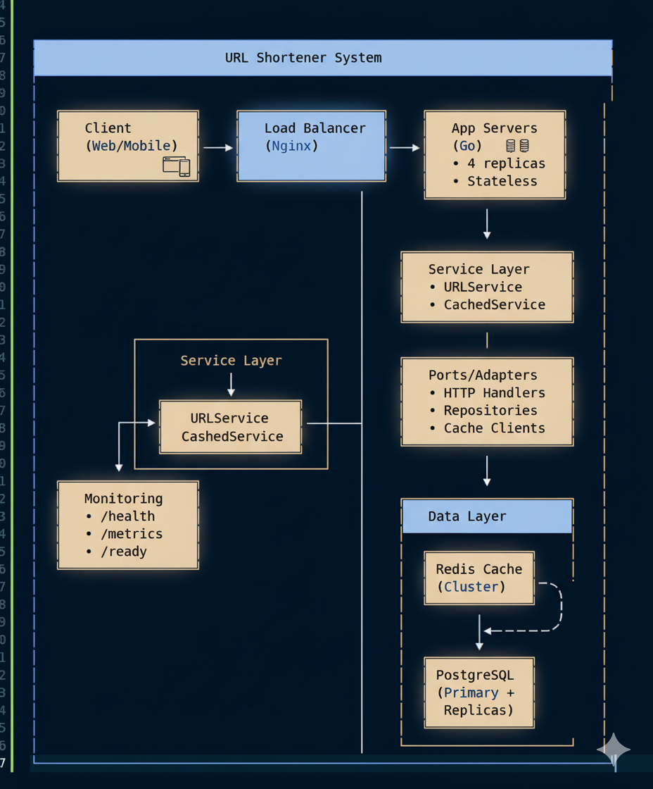

# URL Shortener - Technical Documentation

## Technology Stack

**Go 1.21+** - Excellent performance with built-in concurrency and minimal runtime overhead

**Standard Library** - No framework lock-in, maximum control over HTTP handling, and minimal dependencies

**Hexagonal Architecture** - Clean separation of concerns, highly testable, and maintainable codebase

**PostgreSQL** - ACID compliance for data integrity, JSON support for flexibility, and excellent read/write performance

**Redis** - High-performance caching layer with persistence options and atomic operations for click counting

**Docker** - Consistent development and deployment environments, cloud-agnostic containerization

## System Design



### Architecture Overview
- **Client** - End users accessing the URL shortener
- **Load Balancer (Nginx)** - Distributes traffic across application servers
- **App Servers** - 4+ replicas running the Go application
- **Redis Cache** - Cluster for high-performance caching
- **PostgreSQL** - Primary database

## Quick Start

### Prerequisites
- Docker and Docker Compose
- 2GB RAM minimum, 4GB recommended

### Development Setup

```bash
# Clone and setup environment
git clone https://github.com/mikiasyonas/url-shortener
cd url-shortener
cp .env.example .env

# Start database and Redis
docker-compose up -d postgres redis

# Wait for databases to be ready
sleep 10

# Start application
go run cmd/api/main.go

# Health check
curl http://localhost:8080/health

# Test URL shortening
curl -X POST http://localhost:8080/api/shorten \
  -H "Content-Type: application/json" \
  -d '{"url": "https://example.com"}'

# Test redirection (replace abc123 with actual short code)
curl -I http://localhost:8080/abc123